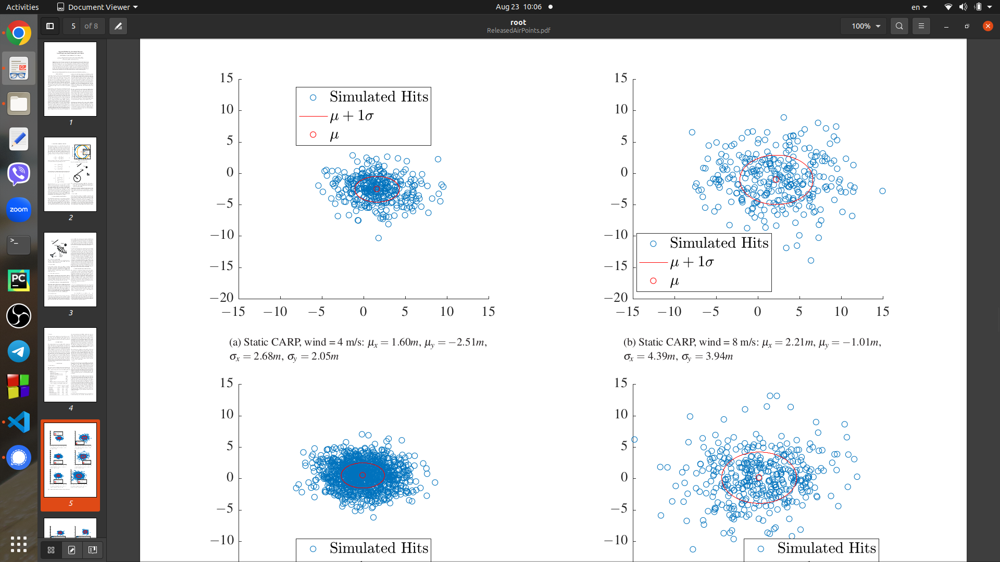

# Computed_Air_Release_Point
Calculate points of release some stuff from the sky for obtain a certain position  on the land
Created on base Norwegian Defence Military order
   One of the many basic operations that a fixed-wing unmanned aerial vehicle (UAV) should
master autonomously is to deliver an object to a precise position. Among several possible delivery
approaches, this paper chooses to focus on releasing the object from the UAV, at a carefully calculated
state, and let it fall freely to the selected landing location. In such an operation, the computation of
suitable release positions, velocity and attitude is essential. Due to time-varying disturbances like wind,
a previously calculated release state may not be suitable once it has been reached by the aircraft. On
account of these challenges, this paper suggests a dynamic calculation of the release state with respect to
the wind velocity and current state of the UAV, with a sufficient re-optimization frequency. This is tested
in simulation and with field tests, and compared with results from a static calculation approach.

